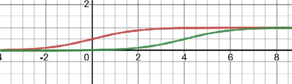

=====
About
=====

++++++++
Overview
++++++++

sigalike is a Python module that provides a simple and efficient way to calculate the shifted sigmoid similarity score between two strings. The shifted sigmoid similarity score acts as a fuzzy string matching metric, allowing for the comparison of strings with varying levels of similarity.

I invented the shifted sigmoid similarity scoring method out of necessity (and a bit of frustration) for a project at work. We had an over-engineered solution using deep learning that was inefficient and not as accurate as we would have liked. So I set out on my own to research a simpler solution. I wanted the new scoring method to: give a perfect score on a perfect match, give a high score on a close match, give a low score for a distant match, give zero for non-matches. I researched and tried many existing fuzzy string matching methods and Python packages but eventually decided I needed to create my own solution to get the result I was after.

+++++++++++
Methodology
+++++++++++

To begin, we find the match ratio between the strings. I define the match ratio as the number of unique words from the shorter string that are present in the longer string divided by the number of unique words in the shorter string, or :math:`match\_ratio = \frac{num\_matched}{len(shorter\_string)}`. Here are a couple examples:

	•	"make up" and "make up make up" have a match ratio of 1.0
	•	"lazy dog" and "the quick brown fox jumps over the lazy dog" also have a match ratio of 1.0
	•	"brown dog" and "quick brown fox" have a match ratio of 0.5

If I were to stop here, we would encounter many false "perfect matches," as illustrated in the second example. In order to mitigate this potential problem, I needed to add a penalty term.

+++++++
Penalty
+++++++

During the above ratio calculations, we also find the difference in the number of unique words between the two strings; e.g. "the quick brown fox jumps over the lazy dog" and "lazy dog" have 8 and 2 unique words, respectively, resulting in a difference of 6. This difference (henceforth referred to as num_extra) is then used in the penalty calculation. I wanted this penalty term to be bounded between 0 and 1 to match the range of the match ratio, while also following the scoring guidelines outlined above. There are two simple cases that we deal with right away:

	•	If the match ratio is 0, we have a non-match and return 0.
	•	If the match ratio is 1 and num_extra is 0, we have a perfect match and return 1.

The tricky bit was finding a function that follows our rules when the match ratio and num_extra are both greater than 0. After researching, I decided to use a shifted sigmoid function (specifically it's the generalized logistic function, but I refer to it as sigmoid). This function is calculated as:
:math:`f(num\_extra - \alpha) = \frac{1}{1 + e^{-(num\_extra - \alpha)}}`, and looks like:

where the red line is the normal sigmoid function with :math:`\alpha = 0`, and the green line is shifted with :math:`\alpha = 4`.
This means that if we have a match ratio of 1 but num_extra is 4, our score is reduced to 0.5. If there are 2 or less extra words, the penalty is not very severe, but if there are 4-6 or more extra words, there will be a heavy penalty. Through some trials, a shift of 4 seems to work well and is therefore the default shift value, but can be adjusted for any use case.
